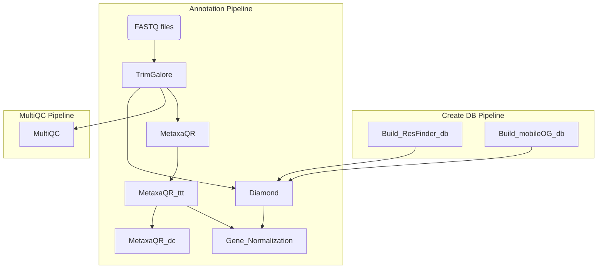

# Pipeline_1

## Overview

Pipeline_1 is a comprehensive bioinformatics pipeline designed for processing and analyzing DNA sequencing data. It consists of three main components: the Create DB Pipeline, the Annotation Pipeline, and the MultiQC Pipeline.

### Workflow Chart



## Components

1. **Create DB Pipeline**: Responsible for building the ResFinder and mobileOG databases.
2. **Annotation Pipeline**: Processes FASTQ files through various stages including trimming (TrimGalore), annotation (Diamond, MetaxaQR), and gene normalization.
3. **MultiQC Pipeline**: Generates a comprehensive MultiQC report from the TrimGalore output.

## Usage

To use Pipeline_1, follow these steps:

1. **Clone the Repository**:

   ```bash
   git clone https://github.com/mnyt-aqw/Pipeline_1.git
   cd Pipeline_1
   ```

2. **Configure the Pipeline**:

- Edit the provided script files to set the paths and parameters according to your data and environment. Just replace {PATH} with your decired path.
- The names wraped in ``are Nextflow related functions or features. You can read more about them in their [doccumentation](https://www.nextflow.io/docs/latest/index.html).

```bash
  # User-configurable variables
 CONTAINER="{PATH}/Pipeline_1/container/Pipeline_1.sif"  # Path to the container image file
 CLUSTEROPTIONS="-A C3SE2023-1-21 -p vera"  # Cluster options
 ID="unique_run_id"  # Unique ID for this run   

 # Input/output paths
 OUTPUT_DIR_PATH="{PATH}/Data/"  # Path to output directory. See `publishDir`
 STOREDIR="{PATH}/storeDir/"  # Path to directory for storing long-term cache.  See `storeDir`
 INPUT_READS_PATH="{PATH}/*R{1,2}*.fastq.gz"  # Path to input reads for annotation.nf . See `Channel.fromFilePairs`. (supports wildcard patterns)
 TRIMGALORE_PATH="{PATH}/TrimGalore/"  # Path to TrimGalore output for multiQC.nf. Probably "{PATH}/storeDir/TrimGalore/"
 MGE_DB_RAW_PATH="{PATH}/mobileOG-db_beatrix-1.6.MC.faa"  # Path to raw mobileOG database file
 MGE_DB_PATH="{PATH}/mobileOG/"  # Path to processed MGE database directory. Probably "{PATH}/storeDir/mobileOG/"
 ARG_DB_PATH="{PATH}/ResFinder/"  # Path to processed ARG database directory. Probably "{PATH}/storeDir/ResFinder/"
 ```

3. **Create Container**

```bash
 cd container
 apptainer build Pipeline_1.sif Pipeline_1.def
 ```

3. **Run the Pipeline**:

- Execute the desired pipeline script.

 ```bash
 # Local
 bash run_nextflow_local.sh -s annotation.nf

 # Cluster
 sbatch run_nextflow_slurm.sh -s annotation.nf
 ```

- Replace `annotation.nf` with the script corresponding to the pipeline you wish to run (`create_db.nf`, `annotation.nf`, or `multiQC.nf`).

## Input and Output

- **Input**:

1. The primary input for the pipeline is FASTQ files for DNA sequencing data.
2. You also need to manually download the mobileOG db form here <https://mobileogdb.flsi.cloud.vt.edu/entries/database_download>.

- **Output**:

1. Trimmed FASTQ sequences and quality report.
2. Taxonomic composition.
3. Composition of ARGs and MGEs.

## Dependencies

All dependencies are within the container, except for Nextflow. The easiest way to install it on the server is via Conda.

```bash
conda install -c bioconda nextflow
```

Nextflow is pre-installed on the cluster and is loaded in the pre-written script like this.

```bash
module purge
module load Nextflow
```

## Run on cluster

If you run the pipeline on a cluster you need to add some lines of code to the script in order to make it a slurm script.

```bash
#!/usr/bin/env bash
#SBATCH -A XXX -p vera (e.g., "-A C3SE2021-2-3 -p vera") ("-A account name -p  partition")
#SBATCH -J name_of_job

# Nr cpu allocated for the Nextflow background job
#SBATCH -c 1

# Time for entire pipeline to run (max 7 day)
#SBATCH -t 00:00:00 

# Output files to monitor progress
#SBATCH --error={Path}/job.%J.err 
#SBATCH --output={Path}/job.%J.out 

# Unload unwanted packages and load Nextflow
module purge
module load Nextflow

### Rest of script
```

## Handling Timeouts on the Cluster

When running Pipeline_1 on a cluster, it's possible that a run may timeout due to the cluster's job scheduling constraints whis is a maximum of 7 days fora job. If a run is terminated by the cluster because it exceeded the allocated time, you can simply restart it using the same command again. The pipeline is designed to resume from where it left off, thanks to Nextflow's caching mechanism and the `storeDir` directive.

## Using `scratch=true` for Efficient Execution

In the pipeline, `scratch=true` is set for each process, which means that all processes are executed on the temporary storage (`/TMPDIR`). It reduces the I/O load on the main file system.

## Normalizing gene abundance

The script X normalizes the abundance of all genes to the number fo bacterial SSU sequences found in the sample as well as teh gene length according to the equation.

$$\frac{Gene\ occurrence / Gene\ length}{nr\ 16s\ rRNA /720 }$$

A gene is considered to be a multi resistance gene if it conferer resistance towards 2 or more antibiotics.

## Customize time

The time each process is allocated in specified in the nextflow.config file and looks like this `time = { 8.hours * Math.pow(1.5, task.attempt - 1) }`. This basically means that each time is allocated 8 hours. And it it times out it the time allocated wiht increase with 50% for a maximum of 3 times due to `maxRetries = 3`. If you have small samples you might want to reduce this time since it will be easier to find time slots for the processes if they are shorter.You can also modify `cpus = 10` if you want to allocate more or fewer cpu's per process.
